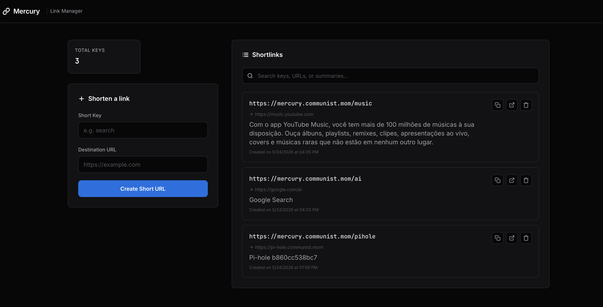

# Mercury

<p align="center">
  
</p>

<p align="center">
  A high-performance, self-hosted shortlink manager for developers.<br />
  Fast, secure, and customizable redirections with an Apple-inspired dark dashboard.
</p>

<p align="center">
  <video src="resources/demo_features.mp4" width="800" controls alt="Mercury Feature Demo"></video>
</p>

---

## Features

- ⚡️ **High-Performance:** Sub-millisecond redirection engine built in Go with Fiber.
- 🎨 **Modern Dashboard:** High-fidelity, minimalist dark UI with instant creation, filtering, and live state updates.
- 📦 **Docker Ready:** Tiny, secure distroless containers with persistent volume mounts.
- 💾 **SQLite Backed:** Local database persistence with automatic unique key constraint enforcement.

---

## Local Development & Installation

### Prerequisites
* Go 1.25 or higher

### Running the Application

1. Download Go dependencies:
   ```bash
   go mod download
   ```
2. Run the application:
   ```bash
   go run main.go
   ```
3. Open the browser:
   * Dashboard: `http://localhost:45800`
   * Shortlink redirects are triggered when the request hostname matches `MERCURY_DOMAIN` (default: `localhost`) or any subdomain of it.

### Local DNS Setup for Hostname Routing

Mercury routes shortlinks by matching the incoming request hostname against `MERCURY_DOMAIN`. When running locally in Docker Compose, this domain is configured as `mercury`.

#### macOS & Safari Local Resolution Guidelines

On macOS, single-label hostnames (like `mercury` without a dot) are ignored by the system DNS resolver (`mDNSResponder`) for security reasons, causing Safari to perform search engine queries instead of resolving local addresses.

To use custom hostnames on macOS and Safari, select one of the following methods:

##### Method A: Using `.` as a Search Domain (Recommended)
This method allows you to type exactly `http://mercury` or `mercury/` in Safari and have macOS automatically expand and resolve it in the background without needing trailing dots in the URL bar.

1. Add `mercury` to your hosts file:
   ```bash
   echo "127.0.0.1  mercury" | sudo tee -a /etc/hosts
   ```
2. Configure a Search Domain:
   * Open **System Settings** > **Network**.
   * Click on your active connection (Wi-Fi or Ethernet) > **Details...** > **DNS**.
   * In the **Search Domains** list on the right, click **+** and add a single dot **`.`**.
   * Click **OK** and **Apply**.
3. Access in Safari: Navigate directly to **`http://mercury`** or **`mercury/`**.
   * **Note on HTTPS Upgrades:** Safari may automatically upgrade the connection to secure HTTPS (`https://mercury`). Because Caddy generates a local self-signed SSL certificate, Safari will present a **"This Connection Is Not Private"** warning page. To bypass this, click **Show Details** -> **visit this website**, and enter your macOS user password.

##### Method B: Using a Trailing Dot
You can bypass search expansion rules entirely by appending a dot to the hostname when entering the URL in Safari:

1. Add `mercury` to your hosts file:
   ```bash
   echo "127.0.0.1  mercury" | sudo tee -a /etc/hosts
   ```
2. Access in Safari: Navigate to **`http://mercury.`** (the trailing dot forces the system to treat it as a Fully Qualified Domain Name and resolve it directly).
   * **Note on HTTPS Upgrades:** Safari may automatically upgrade the connection to secure HTTPS (`https://mercury.`). Because Caddy generates a local self-signed SSL certificate, Safari will present a **"This Connection Is Not Private"** warning page. To bypass this, click **Show Details** -> **visit this website**, and enter your macOS user password.


### Running with Docker

You can build and run the application in a secure, minimal container. To persist the SQLite database across container restarts and recreations, mount a host volume directory and specify the database path via the `MERCURY_DB_PATH` environment variable:

1. Build the Docker image:
   ```bash
   docker build -t mercury .
   ```

2. Run the container with a volume mount:
   ```bash
   docker run -d \
     -p 45800:45800 \
     -v /path/to/local/data:/data \
     -e MERCURY_DB_PATH=/data/mercury.db \
     --name mercury \
     mercury
   ```

### Running with Docker Compose

The [`docker-compose.yml`](docker-compose.yml) orchestrates two services:

- **mercury** — the app, listening internally on port `45800` (not exposed to the host)
- **caddy** — reverse proxy, exposed on ports `80` and `443`, forwarding to `mercury:45800`

This means you access Mercury directly at `http://mercury.test` or `http://localhost` — no port needed!

To start:
```bash
docker compose up -d --build
```

To stop:
```bash
docker compose down
```

The SQLite database is persisted in the `mercury_data` named volume. Caddy's TLS state and configuration are stored in `caddy_data` and `caddy_config`.

### Running Tests
Unit and integration test coverage can be verified by running:
```bash
go test -v ./...
```

---

## Documentation & Reference

* **[Architecture](docs/architecture.md):** Detailed breakdown of system design, Go modules, and repository architecture.
* **[Directory Structure](docs/directory.md):** Full repository map.
* **[API Reference](docs/api.md):** Request and response schemas for all Fiber HTTP endpoints.
