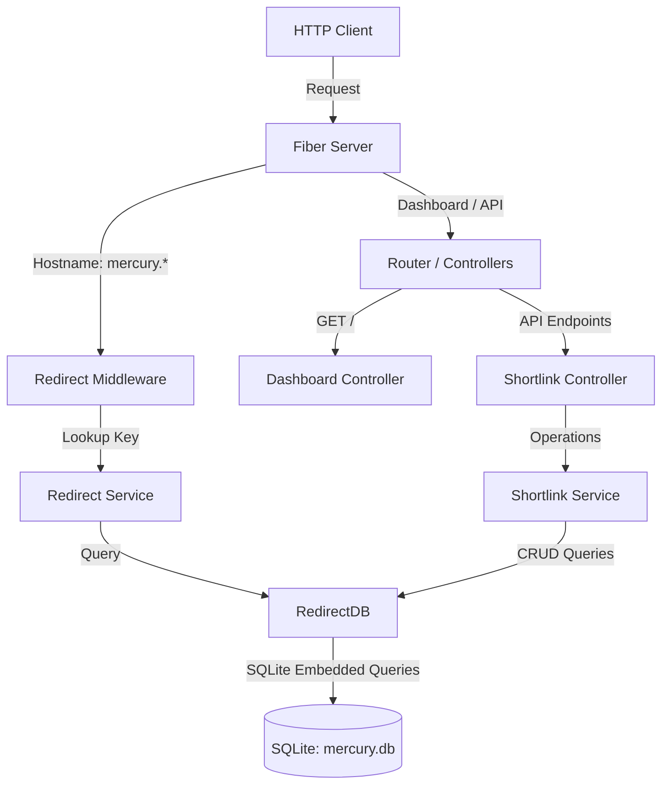

# Mercury Shortlink Service

Mercury is a high-performance, self-hosted shortlink manager built in Go using the Fiber web framework and SQLite. It provides a web dashboard and API endpoints for creating, deleting, and listing shortlinks, alongside a high-speed redirection engine that intercepts subdomain-specific traffic.

---

## Architectural Evolution (v2)

The architecture has been refactored to separate responsibilities, improve testability, and follow strict Go development standards.



### Core Architecture Components

1. **Domain Models (`/internal/structs`)**
   - The central entity is `Shortlink`, which holds the path routing metadata (`Key`, `URL`, `Domain`, `CreatedAt`).

2. **Persistence Layer (`/internal/database`)**
   - Database interaction is managed by `RedirectDB`.
   - Raw SQL queries are decoupled from Go code and loaded using Go's native embedding system (`go:embed`) from SQL files in `/internal/database/sql/`.
   - The database handles migrations automatically on startup (`migrate.sql`).

3. **Service Layer (`/internal/service`)**
   - Split into two focused domain services:
     - `RedirectService`: Handles fast, read-only queries for shortlink resolution during traffic redirection.
     - `ShortlinkService`: Provides complete management functionality (listing, creation, deletion) for the administrator dashboard.

4. **Middleware (`/internal/middleware`)**
   - `RedirectMiddleware`: Analyzes the request hostname. If the hostname starts with `mercury.`, it interprets the first segment of the path as a shortlink key. It queries `RedirectService` to resolve the destination URL and performs a `302 Found` HTTP redirect. If the key is not found, it responds with a static 404 page.

5. **Controllers & Router (`/internal/controllers`, `/internal/server`)**
   - `DashboardController`: Serves the embedded single-page application dashboard.
   - `ShortlinkController`: Exposes API routes for creating, listing, and deleting shortlinks.
   - Routes are mapped inside `routes.go` and the whole application lifecycle is encapsulated in `server.go`.

---

## Constructor Naming Pattern

All struct constructors are standardized to follow the `New<StructName>` naming pattern rather than using stuttering package-level constructors. This enforces consistent initialization across all components:

| Package | Struct | Constructor Function |
| :--- | :--- | :--- |
| `database` | `RedirectDB` | `NewRedirectDB(dbPath string) (*RedirectDB, error)` |
| `service` | `RedirectService` | `NewRedirectService(db *RedirectDB) *RedirectService` |
| `service` | `ShortlinkService` | `NewShortlinkService(db *RedirectDB) *ShortlinkService` |
| `middleware` | `fiber.Handler` | `NewRedirectMiddleware(svc *RedirectService) fiber.Handler` |
| `controllers` | `ShortlinkController` | `NewShortlinkController(svc *ShortlinkService) *ShortlinkController` |
| `controllers` | `DashboardController` | `NewDashboardController() *DashboardController` |
| `server` | `Server` | `NewServer(dbPath string) (*Server, error)` |

---

## Directory Structure

```
.
├── README.md                      # Documentation
├── go.mod                         # Go module definition
├── go.sum                         # Go dependency checksums
├── main.go                        # Application entry point
├── mercury.db                     # SQLite database file
└── internal
    ├── controllers
    │   ├── dashboard.go           # Dashboard view controller
    │   └── shortlink.go           # Shortlink API controller
    ├── database
    │   ├── queries.go             # Embedded query registry
    │   ├── redirect.go            # SQLite client & schema migration
    │   ├── redirect_test.go       # Database unit tests
    │   └── sql
    │       ├── delete_link.sql    # Delete query
    │       ├── get_link.sql       # Get shortlink query
    │       ├── insert_link.sql    # Insert shortlink query
    │       ├── list_links.sql     # List all shortlinks query
    │       └── migrate.sql        # Database initialization schema
    ├── middleware
    │   └── redirect.go            # Hostname-based routing middleware
    ├── server
    │   ├── routes.go              # Route registrations
    │   ├── server.go              # Server configuration and setup
    │   └── server_test.go         # Integration test suite for HTTP server
    ├── service
    │   ├── redirect.go            # Redirection service
    │   ├── redirect_test.go       # Redirect service test cases
    │   ├── shortlink.go           # Management service
    │   └── shortlink_test.go      # Shortlink service test cases
    ├── structs
    │   └── shortlink.go           # Core Domain struct
    └── templates
        ├── 404.html               # Not Found embedded static template
        ├── index.html             # Dashboard frontend embedded template
        └── templates.go           # Embedded templates registry
```

---

## API Reference

### Shortlinks

#### List Shortlinks
* **Endpoint:** `GET /api/links`
* **Response Status:** `200 OK`
* **Response Body:**
```json
[
  {
    "key": "github",
    "url": "https://github.com",
    "domain": "localhost:45800",
    "created_at": "2026-05-23T19:51:13Z"
  }
]
```

#### Create Shortlink
* **Endpoint:** `POST /api/shorten`
* **Request Body:**
```json
{
  "key": "google",
  "url": "https://google.com",
  "domain": "localhost:45800"
}
```
* **Response Status:** `201 Created`
* **Response Body:**
```json
{
  "message": "shortlink created successfully"
}
```

#### Delete Shortlink
* **Endpoint:** `DELETE /api/links/:key`
* **Response Status:** `200 OK`
* **Response Body:**
```json
{
  "message": "shortlink deleted successfully"
}
```

---

## Local Development & Installation

### Prerequisites
* Go 1.25 or higher

### Running the Application
1. Download Go dependencies:
   ```bash
   go mod download
   ```
2. Run the application:
   ```bash
   go run main.go
   ```
3. Open the browser:
   * Dashboard: `http://localhost:45800`
   * Target shortlink redirects occur when hostnames start with `mercury.`, such as `http://mercury.localhost:45800/key`.

### Running Tests
Unit and integration test coverage can be verified by running:
```bash
go test -v ./...
```
