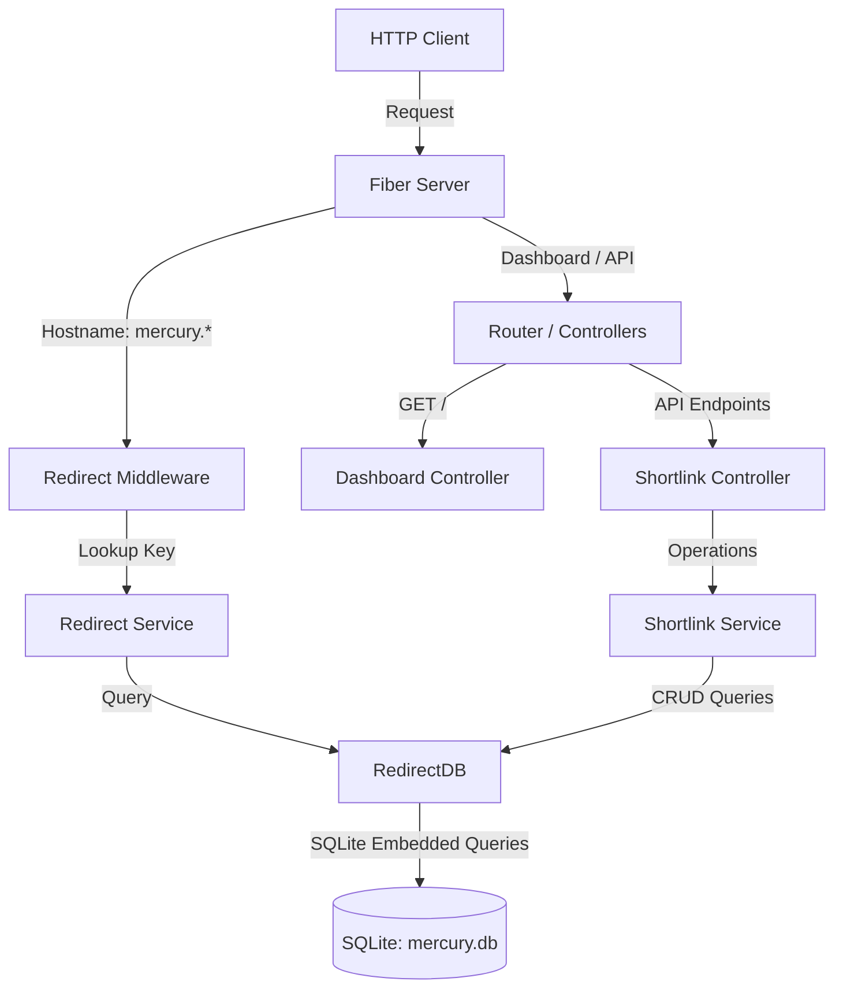

# Mercury Architecture Documentation

This document describes the modular architecture of the Mercury Shortlink Service, standardizing responsibilities and styling patterns across packages.

---

## Architectural Evolution (v2)

The architecture is refactored to separate responsibilities, improve testability, and follow Go development standards.

### Core Architecture Components

1. **Domain Models (`/internal/structs`)**
   - The central entity is `Shortlink`, which holds the path routing metadata (`Key`, `URL`, `Domain`, `CreatedAt`).

2. **Persistence Layer (`/internal/database`)**
   - Database interaction is managed by `RedirectDB`.
   - Raw SQL queries are decoupled from Go code and loaded using Go's native embedding system (`go:embed`) from SQL files in `/internal/database/sql/`.
   - The database handles migrations automatically on startup (`migrate.sql`).

3. **Service Layer (`/internal/service`)**
   - Split into two focused domain services:
     - `RedirectService`: Handles fast, read-only queries for shortlink resolution during traffic redirection.
     - `ShortlinkService`: Provides complete management functionality (listing, creation, deletion) for the administrator dashboard.

4. **Middleware (`/internal/middleware`)**
   - `RedirectMiddleware`: Analyzes the request hostname. If the hostname starts with `mercury.`, it interprets the first segment of the path as a shortlink key. It queries `RedirectService` to resolve the destination URL and performs a `302 Found` HTTP redirect. If the key is not found, it responds with a static 404 page.

5. **Controllers & Router (`/internal/controllers`, `/internal/server`)**
   - `DashboardController`: Serves the embedded single-page application dashboard.
   - `ShortlinkController`: Exposes API routes for creating, listing, and deleting shortlinks.
   - Routes are mapped inside `routes.go` and the whole application lifecycle is encapsulated in `server.go`.

---

## Constructor Naming Pattern

All struct constructors are standardized to follow the `New<StructName>` naming pattern rather than using stuttering package-level constructors. This enforces consistent initialization across all components:

| Package | Struct | Constructor Function |
| :--- | :--- | :--- |
| `database` | `RedirectDB` | `NewRedirectDB(dbPath string) (*RedirectDB, error)` |
| `service` | `RedirectService` | `NewRedirectService(db *RedirectDB) *RedirectService` |
| `service` | `ShortlinkService` | `NewShortlinkService(db *RedirectDB) *ShortlinkService` |
| `middleware` | `fiber.Handler` | `NewRedirectMiddleware(svc *RedirectService) fiber.Handler` |
| `controllers` | `ShortlinkController` | `NewShortlinkController(svc *ShortlinkService) *ShortlinkController` |
| `controllers` | `DashboardController` | `NewDashboardController() *DashboardController` |
| `server` | `Server` | `NewServer(dbPath string) (*Server, error)` |
